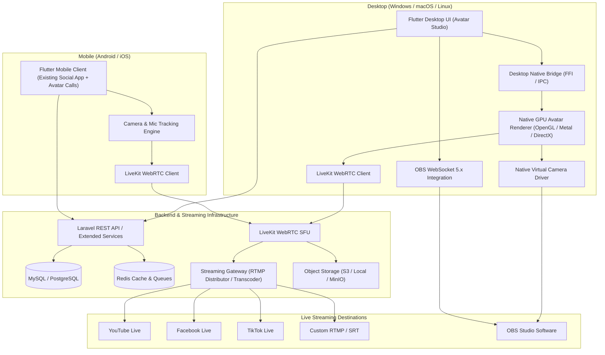

# EXISTING PROJECT ARCHITECTURE & TARGET EXTENSION MAP
**Project: AI Avatar Studio + Social Media Streaming Platform**  
**Document: `/docs/EXISTING_PROJECT_ARCHITECTURE.md`**  
**Version:** 1.0.0  
**Date:** October 2026  

---

## 1. Executive Summary & Project Baseline

The existing codebase, known internally as **"Orange"**, is a full-stack production-grade social discovery, dating, and live-streaming application. It features a complete mobile client developed in **Flutter** (Dart), a web backend developed in **Laravel (PHP)**, a **MySQL** relational database schema, and cloud integrations with **Firebase** (Auth, Firestore, Messaging) and **Agora RTC** (Live video & audio broadcast).

Our mandate is to **EXTEND** this working ecosystem into an enterprise-grade, cross-platform **Avatar Studio and Live Multi-Platform Streaming Platform** (Windows, macOS, Linux, Android, iOS) without deleting, replacing, rewriting, or breaking any of the existing working social-media, dating, chat, or live-broadcasting features.

---

## 2. In-Depth Inspection of Existing Architecture

### 2.1 Repository Layout
```
/home/thbinnovation/Desktop/Taitanic/
├── orange_backend/
│   └── orange_backend/          # Laravel 8.x backend & Admin Portal
│       ├── app/
│       │   ├── Http/Controllers/ # 20 REST & Admin Controllers
│       │   ├── Http/Middleware/  # CheckHeader (API Key), CheckLogin
│       │   └── Models/          # 34 Eloquent Models
│       ├── config/              # App, Database, Services, Filesystems
│       ├── database/            # Migrations & Seeders
│       ├── public/              # Web assets, storage symlink
│       ├── resources/views/     # 28 Blade admin templates (Stisla/Bootstrap)
│       └── routes/
│           ├── api.php          # 60+ REST API endpoints
│           └── web.php          # Admin panel & Web routes
├── orange_database.sql          # Full MySQL dump (27 relational tables)
└── Orange_flutter/
    └── Orange/                  # Flutter application
        ├── android/             # Native Android build & Gradle configs
        ├── ios/                 # Native iOS Xcode project & Pods
        ├── assets/              # Icons, CSVs, Fonts, Graphics
        ├── lib/
        │   ├── api_provider/    # Http networking layer (REST endpoints)
        │   ├── common/          # Reusable UI widgets & animations
        │   ├── model/           # Dart data models
        │   ├── screen/          # 40+ Feature screens (Stacked MVVM + GetX)
        │   ├── service/         # Firebase, Session, Ads, Subscriptions, Avatar
        │   └── utils/           # Asset references, Colors, URLs, Constants
        └── pubspec.yaml         # Flutter SDK & dependencies
```

---

### 2.2 Frontend Framework (Mobile Client)
* **Framework:** Flutter (Dart SDK `^3.5.4` / Dart 3.x).
* **Architecture:** **Stacked (MVVM)** (`stacked: ^3.5.0`) coupled with **GetX** (`get: ^4.7.3`) for routing, overlays, and reactive state.
* **Platforms in Repo:** Android (`android/`) and iOS (`ios/`).
* **Target Platforms Needed:** **Windows, macOS, Linux, Android, iOS**.
* **Key Dependencies:**
  * **Networking:** `http: ^1.6.0`, `cached_network_image: ^3.4.1`.
  * **Local State / Storage:** `get_storage: ^2.1.1` (box `'Orange'`), `path_provider: ^2.1.5`.
  * **Real-time Live Streaming:** `agora_rtc_engine: ^6.5.3` (used for low-latency live broadcasting).
  * **Cloud Services:** `firebase_core: ^4.5.0`, `firebase_messaging: ^16.1.2`, `firebase_auth: ^6.2.0`, `cloud_firestore: ^6.1.3`.
  * **Media & Hardware:** `image_picker: ^1.2.1`, `video_player: ^2.11.1`, `wakelock_plus: ^1.5.1`.
  * **Subscriptions & Monetization:** `purchases_flutter: ^9.15.0` (RevenueCat), `google_mobile_ads: ^7.0.0`.
  * **Localization:** `intl: ^0.20.2`, `flutter_localizations` (multilingual ARB files).

---

### 2.3 Backend Technology & Server Framework
* **Framework:** **Laravel 8.54** (PHP 7.4 / 8.x).
* **Web Server Configuration:** Apache / Nginx / PHP built-in server with `.htaccess` and `server.php`.
* **Database Driver:** MySQL 8.x / MariaDB (`DB_CONNECTION=mysql`).
* **Authentication & Middleware:**
  * Client API: Protected by `CheckHeader` middleware (`$_SERVER['HTTP_APIKEY'] == '123'`).
  * Admin Portal: Session-based authentication via `CheckLogin` middleware and `admin_user` table.
  * FCM Token Service: Google API Client (`google/apiclient: ^2.15`) using `googleCredentials.json` via HTTP v1 API.

---

### 2.4 Database Schema Analysis (`orange_database.sql`)
The MySQL database contains **27 relational tables**:
1. `users`: Master user table (profile, identity, gender, bio, location coordinates, wallet balance, diamonds, streaming status, social links for Instagram, YouTube, Facebook).
2. `posts` & `post_contents`: Social feed posts with text, images, and videos.
3. `comments`: Post comments with user references and timestamps.
4. `likes`: Likes on user posts.
5. `images`: Additional profile gallery images.
6. `stories`: 24-hour ephemeral image/video stories.
7. `live_application`: Creator applications for live broadcasting privileges.
8. `live_history`: Historical stream records (duration, diamonds collected, viewers).
9. `admin_user`: Admin dashboard login credentials and access levels.
10. `appdata`: Global system configuration, coin prices, commission fees, live viewing costs, app links.
11. `diamond_packs`: In-app purchase packages for diamond coin purchases.
12. `gifts`: Virtual gifts that viewers send to live streamers during broadcasts.
13. `redeem_requests`: Payout and cash-out requests submitted by creators.
14. `following_lists`: Follower-following social graph.
15. `like_profiles`: Dating swipe likes and match records.
16. `user_notification`: User activity notifications.
17. `admin_notification`: System-wide broadcasts and admin alerts.
18. `relationship_goals`, `religions`, `languages`, `interests`: Profile preference and discovery taxonomy.
19. `verification_request`: Identity verification documents and KYC status.
20. `package`: Premium subscription tiers.
21. `pages`: Static legal pages (Terms of Use, Privacy Policy).
22. `onboarding_screens`: Splash onboarding sequence slides.
23. `reports`: Abuse and content moderation reports.

---

### 2.5 Authentication & User Profile System
* **Client Authentication Methods:**
  * Google Sign-In (`google_sign_in: ^7.2.0`).
  * Apple Sign-In (`sign_in_with_apple: ^7.0.1`).
  * Email / Identity credentials (`addUserDetails` endpoint).
  * Fake User testing profile login (`fakeUserLogin` endpoint).
* **Session Management:**
  * Persisted locally in `GetStorage('Orange')` under key `user`.
  * User profile loaded into memory via `SessionManager.instance.getUser()`.
* **Social Links:**
  * Profile already contains fields for `instagram`, `youtube`, and `facebook` links.

---

### 2.6 Real-Time & Live Streaming Architecture
1. **Agora RTC:**
   * Broadcaster connects to Agora channel using token generated by `generateAgoraToken` API.
   * Viewer joins channel with low latency mode (`AudienceLatencyLevelType.audienceLatencyLevelUltraLowLatency`).
2. **Cloud Firestore:**
   * `liveHostList/{userId}`: Document holding active live host metadata (`watchingCount`, `collectedDiamond`, `isAvatarMode`, `avatarUrl`, etc.).
   * `liveHostList/{userId}/comments`: Subcollection streaming live broadcast comments and virtual gift events.
   * `userChatList/{userId}/userList`: 1-to-1 direct messaging conversation threads.
3. **Recently Added Live Avatar System:**
   * Broadcaster avatar selection with `LiveAvatarSheet`.
   * Real-time Agora audio volume indication (`onAudioVolumeIndication` at 80ms interval).
   * Voice-to-body & lip-sync controller (`VoiceMovementSyncController`).
   * Dynamic 2.5D canvas rendering for presets and custom uploaded photos (`LiveAvatarSyncWidget`).

---

### 2.7 Media Upload & Storage
* **Local Storage:** Files uploaded through multipart POST `/api/storeFileGivePath` (`SettingController::storeFileGivePath`).
* **Storage Location:** Stored in Laravel's `storage/app/public/uploads` and served through `public/storage/uploads`.
* **S3 Capability:** `GlobalFunction::uploadFilToS3` exists for AWS S3 object storage compatibility.

---

### 2.8 Admin Panel & Moderation
* Built with Laravel Blade views in `resources/views/`.
* Admin features: User management, live streamer approval (`allowLiveToUser`), post & comment moderation, redemption payout approval, diamond package pricing, and global app settings.

---

## 3. Architecture Gap Analysis: Mobile vs. Desktop Studio

| Dimension | Existing System ("Orange") | Target System ("Avatar Studio + Social Streaming") |
| :--- | :--- | :--- |
| **Platforms** | Android, iOS | **Windows, macOS, Linux, Android, iOS** |
| **Primary Focus** | Mobile dating, social feed, mobile broadcast | **Professional Desktop Avatar Studio + Mobile Companion** |
| **Desktop UI** | None | **Dedicated Pro Studio Dashboard with 10 Modules** |
| **Avatar Engine** | Lightweight 2.5D Canvas inside Flutter | **Pluggable `AvatarEngine` Abstraction + Native GPU Renderer** |
| **Virtual Camera**| None | **Native Virtual Camera (DirectShow/MediaFoundation, CoreMedia, v4l2loopback)** |
| **OBS Integration**| None | **Bi-directional OBS WebSocket 5.x Controller** |
| **RTC Video Calls**| Agora RTC + Firestore | **LiveKit WebRTC SFU + Production Token Gateway** |
| **Multi-Streaming**| Single channel Agora broadcast | **Streaming Gateway (LiveKit Egress / FFmpeg) to YouTube, FB, TikTok, Custom RTMP** |
| **Social Auth** | Social URL text fields | **Encrypted OAuth2 Tokens & Live Broadcast APIs (`social_accounts`)** |

---

## 4. Target Extension Architecture

### 4.1 System Overview


---

## 5. Non-Destructive Extension Strategy

### 5.1 Principle of Non-Regression
1. **Preserve Existing Mobile Routes & Screens:** Keep `DashboardScreen`, `FeedScreen`, `MessageScreen`, `ExploreScreen`, `LiveGridScreen`, and all dating/social features fully intact.
2. **Reuse Existing User Model:** The existing `users` table remains the single source of truth for accounts. Avatar studio profiles link directly to `user_id`.
3. **Reuse Existing Storage & Media Pipelines:** The existing `/api/storeFileGivePath` handles standard avatar uploads, while new dedicated avatar asset endpoints extend it for 3D/GLB/VRM models.
4. **Desktop Adaptive Mode:** When running on desktop platforms (`Platform.isWindows || Platform.isMacOS || Platform.isLinux`), Flutter initializes the full professional **Avatar Studio Dashboard**; when on mobile, it runs the companion social and calling interface.

---

## 6. Required Database Extensions

We extend the database non-destructively by adding dedicated tables with foreign keys to `users`:

### 6.1 New Tables Summary
* **`avatars`**: Stores user-created or uploaded avatars (3D GLTF/GLB, 2D vector, AI photo, preset keys, rig configurations, texture maps).
* **`avatar_assets`**: Binary asset references (meshes, textures, voice viseme maps, blend shapes).
* **`calls`**: WebRTC 1-to-1 and group video call sessions.
* **`call_participants`**: Participant states (`ringing`, `accepted`, `rejected`, `active`, `ended`) and connection telemetry.
* **`rooms`**: LiveKit / WebRTC room identifiers and token generation records.
* **`streams`**: Multi-platform broadcast sessions with title, description, and status.
* **`stream_destinations`**: Target streaming platforms (YouTube, Facebook, TikTok, Custom RTMP) with AES-256 encrypted stream keys and ingestion URLs.
* **`social_accounts`**: Connected third-party OAuth2 accounts with encrypted refresh/access tokens and scope status.
* **`recordings`**: Session recordings stored in object storage with durations, resolutions, and signed playback URLs.
* **`user_devices`**: Desktop and mobile device registrations for incoming call pushes and desktop notifications.
* **`usage_metrics`**: Performance logs (CPU, GPU, FPS, latency, packet loss) for quality monitoring.

---

## 7. Implementation Roadmap (Phases 1 - 15)

* **Stage 1 (Completed):** Complete inspection of existing Flutter codebase, Laravel backend, and MySQL database.
* **Stage 2 (Completed):** Architecture documentation in `/docs/EXISTING_PROJECT_ARCHITECTURE.md`.
* **Stage 3:** Database migrations & API extensions in Laravel backend.
* **Stage 4:** Pluggable `AvatarEngine` interface & modular engine abstraction in Flutter.
* **Stage 5:** Desktop Avatar Studio application & professional dashboard layout.
* **Stage 6:** GPU rendering pipeline & face/motion tracking bridge.
* **Stage 7:** LiveKit WebRTC client & server orchestration.
* **Stage 8:** 1-to-1 & group avatar video calling flow.
* **Stage 9:** Native Virtual Camera integration (Windows DirectShow, macOS CoreMedia, Linux v4l2loopback).
* **Stage 10:** OBS Studio WebSocket 5.x bi-directional integration.
* **Stage 11:** Multi-destination Streaming Gateway (RTMP/RTMPS distribution).
* **Stage 12:** Social media OAuth2 & streaming integrations (YouTube, Facebook, TikTok, Custom RTMP).
* **Stage 13:** Performance optimization (hardware encoding, zero-copy pipelines, sub-15% CPU).
* **Stage 14:** Comprehensive testing suite (unit, widget, integration, audio/video synchronization).
* **Stage 15:** Multi-platform packaging for Windows, macOS, Linux, Android, and iOS.

---
*Created and verified for Antigravity AI Avatar Studio project.*
